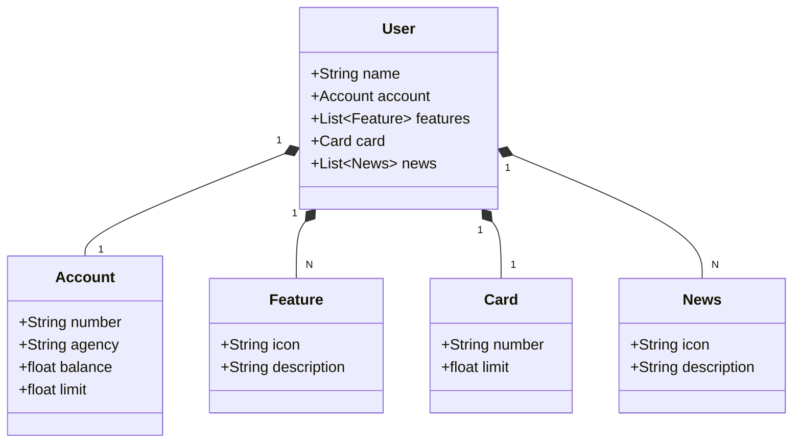

# Bank API Project
Java Restful API criada para o projeto final da Dio.

##Diagrama de Classes


## IMPORTANTE

Este projeto foi construído com um viés totalmente educacional para a DIO. Por isso, disponibilizamos uma versão mais robusta dele no repositório oficial da DIO:

### [digitalinnovationone/santander-dev-week-2023-api](https://github.com/digitalinnovationone/santander-dev-week-2023-api)

Lá incluímos todas os endpoints de CRUD, além de aplicar boas práticas (uso de DTOs e refinamento na documentação da OpenAPI). Sendo assim, caso queira um desafio/referência mais completa é só acessar 👊🤩
```
